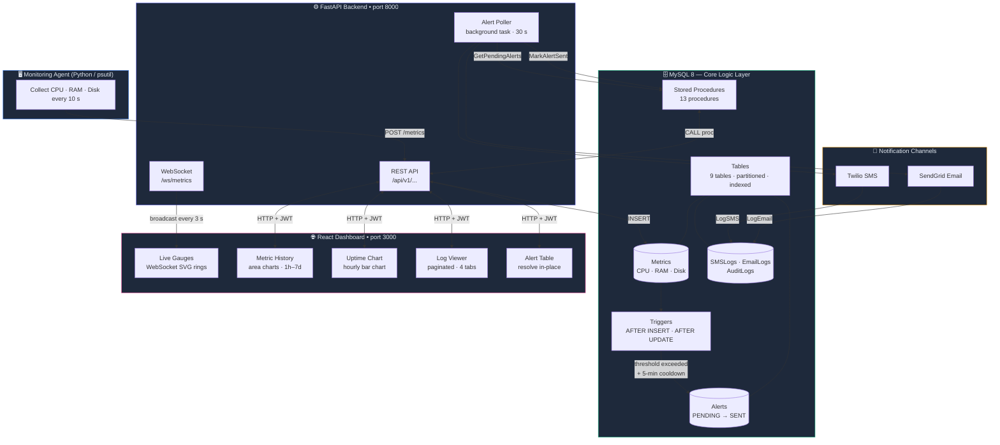
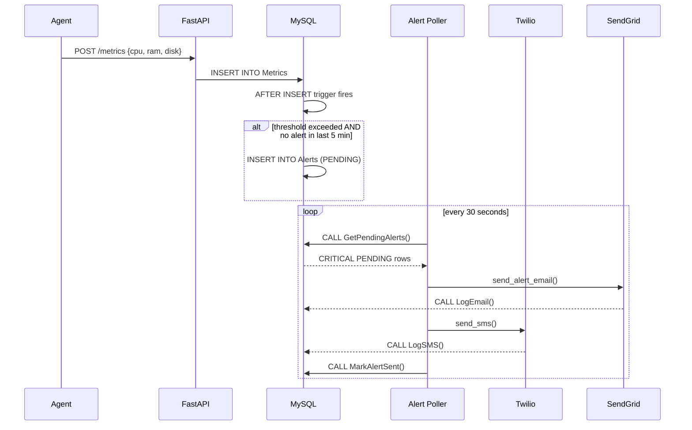

# Server Monitoring System

A **production-style, database-centric** full-stack server monitoring platform built as a DBMS project — featuring real-time WebSocket dashboards, SMS & email alerting, paginated log viewer, and uptime history charts.

---

## Architecture Overview



### Database-Centric Design

**MySQL is the core logic layer.** The FastAPI backend is intentionally thin — it calls stored procedures and inserts data. All business rules live in the database.

| Concern | Handled By |
|---|---|
| Alert rule evaluation | `AFTER INSERT` trigger on `Metrics` |
| 5-minute alert cooldown | `NOT EXISTS` subquery inside trigger |
| Alert resolution + audit | Stored procedure `ResolveAlert()` with `TRANSACTION` |
| Server health aggregation | Stored procedure `GetServerHealth()` |
| Audit logging | `AFTER UPDATE` trigger on `Alerts`  `AuditLogs` |
| Paginated log browsing | Stored procedure `GetPaginatedLogs()` with `SQL_CALC_FOUND_ROWS` |
| Uptime history | Stored procedure `GetUptimeHistory()` with hourly bucketing |
| Time-series performance | `(server_id, recorded_at)` composite index + range partitioning |
| SMS dispatch tracking | `LogSMS()` procedure  `SMSLogs` table |
| Email dispatch tracking | `LogEmail()` procedure  `EmailLogs` table |

---

## Tech Stack

| Layer | Technology |
|---|---|
| Database | MySQL 8.0 — triggers, stored procedures, partitioning, transactions |
| Backend | Python 3.12+ / FastAPI / aiomysql |
| Frontend | React 18 / Vite / Recharts |
| Real-time | FastAPI WebSocket  live gauge push every 3 s |
| Agent | Python / psutil |
| SMS Alerts | Twilio (mock-safe, CRITICAL alerts only) |
| Email Alerts | SendGrid (mock-safe) |

---

## Features

- **Live Gauges** — WebSocket-powered CPU/RAM/Disk ring gauges that update every 3 seconds (no polling)
- **Metric History Charts** — Area charts with 1h / 6h / 24h / 7d range tabs, auto-bucketed by MySQL
- **Uptime History** — Hourly bar chart + color-coded status strip (green=UP, red=DOWN) with % badge
- **Log Viewer** — Server-side paginated table (Alerts / SMS Logs / Email Logs / Audit Trail) with severity filter and page controls
- **SMS Alerting** — Background poller dispatches Twilio SMS for CRITICAL alerts, 5-minute cooldown enforced by trigger
- **Email Alerting** — SendGrid HTML + plain-text email alongside SMS for every CRITICAL alert
- **Alert Resolution** — Resolved via stored procedure with transaction and automatic audit trail
- **JWT Auth** — Token-based login with role-based access

---

## Project Structure

```
server-monitor/
 database/
    001_schema.sql                  # Tables, indexes, partitions
    002_triggers.sql                # AFTER INSERT / UPDATE triggers (5-min cooldown)
    003_procedures.sql              # Core stored procedures
    004_seed.sql                    # Default roles, users, servers, alert rules
    005_email_logs.sql              # EmailLogs table + LogEmail procedure
    006_log_viewer_and_uptime.sql   # GetPaginatedLogs, GetUptimeHistory, GetLogCounts
 backend/
    app/
       api/routes/
          auth.py                 # JWT login / register / me
          servers.py              # Server CRUD + health
          metrics.py              # Metric ingestion + history
          alerts.py               # Alert list / summary / resolve
          logs.py                 # Paginated log viewer + uptime endpoint
          websocket.py            # WS /ws/metrics — broadcasts live metrics
       core/
          config.py               # Pydantic Settings (env vars)
          database.py             # aiomysql connection pool
          security.py             # JWT encode / decode
       services/
          sms_service.py          # Twilio SMS dispatch
          email_service.py        # SendGrid email dispatch
          alert_poller.py         # Background task: email  SMS  mark SENT
       main.py                     # FastAPI entry-point + lifespan
    requirements.txt
    .env.example
    Dockerfile
 agent/
    agent.py                        # psutil collector  POST /metrics every 10 s
    requirements.txt
    .env.example
    Dockerfile
 frontend/
    src/
       components/
          LiveGauges.jsx          # WebSocket SVG ring gauges
          MetricsCharts.jsx       # Line chart (last 50 points)
          MetricsHistoryChart.jsx # Area chart with range tabs
          UptimeChart.jsx         # Hourly bar chart + status strip
          LogViewer.jsx           # Paginated log table with filters
          ServerGrid.jsx          # Server status cards grid
          AlertTable.jsx          # Alert history table
          AlertSummary.jsx        # Summary count cards
          AddServerModal.jsx      # Register new server modal
       pages/
          LoginPage.jsx           # Glassmorphism login
          DashboardPage.jsx       # Dashboard / Log Viewer tabs
       services/api.js             # Axios client with JWT interceptors
       hooks/usePolling.js         # Generic polling hook
    package.json
    vite.config.js
    Dockerfile
 docker-compose.yml
 .env.example
 README.md
```

---

## Database Schema

### Tables

| Table | Purpose |
|---|---|
| `Roles` | RBAC role definitions (admin, viewer) |
| `Users` | System users with bcrypt-hashed passwords |
| `Servers` | Registered monitored servers |
| `Metrics` | Time-series CPU/RAM/Disk (range-partitioned by year) |
| `AlertRules` | Configurable thresholds per metric and severity |
| `Alerts` | Created by trigger, resolved by stored procedure |
| `SMSLogs` | Full audit trail of Twilio SMS dispatches |
| `EmailLogs` | Full audit trail of SendGrid email dispatches |
| `AuditLogs` | Automatic change tracking via trigger |

### Key Stored Procedures

| Procedure | Description |
|---|---|
| `GetServerHealth(id)` | Latest metrics + active alert count in one query |
| `GetMetricHistory(id, hours)` | Auto-bucketed time-series (raw  1min  5min  1hr) |
| `GetUptimeHistory(id, hours)` | Hourly UP/DOWN buckets based on metric presence |
| `GetPaginatedLogs(type, severity, page, size)` | Server-side pagination with `SQL_CALC_FOUND_ROWS` |
| `ResolveAlert(alert_id, user_id)` | Transaction-safe resolve with rollback handler |
| `GetPendingAlerts()` | CRITICAL PENDING alerts for dispatch |
| `MarkAlertSent(alert_id)` | Update status PENDING  SENT |

---

## Quick Start

### Manual Setup (no Docker)

#### 1. Database
```bash
# Windows — add MySQL to PATH
$env:Path += ";C:\Program Files\MySQL\MySQL Server 8.0\bin"

mysql -u root -p < database/001_schema.sql
mysql -u root -p < database/002_triggers.sql
mysql -u root -p < database/003_procedures.sql
mysql -u root -p < database/004_seed.sql
mysql -u root -p < database/005_email_logs.sql
mysql -u root -p < database/006_log_viewer_and_uptime.sql
```

#### 2. Backend
```bash
cd backend
cp .env.example .env    # fill in DB password, Twilio, SendGrid keys
pip install -r requirements.txt
uvicorn app.main:app --reload --port 8000
```

#### 3. Agent
```bash
cd agent
cp .env.example .env    # set SERVER_ID=1
pip install -r requirements.txt
python agent.py
```

#### 4. Frontend
```bash
cd frontend
npm install
npm run dev             # http://localhost:5173
```

### Docker (all services)
```bash
cp .env.example .env
docker-compose up --build -d
```

Services available at:
- **Frontend**  http://localhost:3000
- **Backend API**  http://localhost:8000
- **API Docs**  http://localhost:8000/docs
- **WebSocket**  ws://localhost:8000/ws/metrics

---

## Default Credentials

| Username | Password | Role |
|---|---|---|
| `admin` | `admin123` | Admin |

> Change these immediately in production via the `Users` table.

---

## API Endpoints

| Method | Endpoint | Description |
|---|---|---|
| POST | `/api/v1/auth/login` | Get JWT token |
| GET | `/api/v1/auth/me` | Current user info |
| POST | `/api/v1/servers/` | Register server |
| GET | `/api/v1/servers/` | List all servers |
| GET | `/api/v1/servers/{id}/health` | Health via stored proc |
| POST | `/api/v1/metrics/` | Ingest metric point (agent) |
| GET | `/api/v1/metrics/{id}/latest` | Last 50 data points |
| GET | `/api/v1/metrics/{id}/history?range=1h` | Bucketed history (1h/6h/24h/7d) |
| GET | `/api/v1/alerts/` | Paginated alert history |
| GET | `/api/v1/alerts/summary` | Counts by severity  status |
| POST | `/api/v1/alerts/{id}/resolve` | Resolve alert (transaction) |
| GET | `/api/v1/logs/?log_type=alerts&page=1` | Paginated log viewer |
| GET | `/api/v1/logs/counts` | Badge counts for each log type |
| GET | `/api/v1/logs/uptime/{id}?hours=48` | Hourly uptime history |
| WS  | `/ws/metrics` | Live metric stream (WebSocket) |

---

## Alert Flow



---

## Environment Variables

### `backend/.env`

| Variable | Purpose |
|---|---|
| `DB_PASSWORD` | MySQL password |
| `JWT_SECRET_KEY` | Secret for signing JWTs |
| `TWILIO_ACCOUNT_SID` | Twilio SID (starts with `AC`) |
| `TWILIO_AUTH_TOKEN` | Twilio auth token |
| `TWILIO_FROM_NUMBER` | Verified Twilio sender number |
| `SMS_RECIPIENT_NUMBER` | Alert destination (e.g. `+919481578981`) |
| `SENDGRID_API_KEY` | SendGrid key — blank = mock mode |
| `EMAIL_FROM` | Verified SendGrid sender address |
| `EMAIL_RECIPIENT` | Alert destination email |
| `ALERT_POLL_INTERVAL_SECONDS` | Poller interval (default `30`) |

### `agent/.env`

| Variable | Purpose |
|---|---|
| `API_BASE_URL` | Backend URL (`http://localhost:8000/api/v1`) |
| `SERVER_ID` | ID of this server in the DB (set `1` after seed) |
| `COLLECT_INTERVAL` | Seconds between metric sends (default `10`) |

---

## Mock Mode

Both alerting channels are mock-safe — no real API keys required to run locally:

| Channel | Mock condition | Behaviour |
|---|---|---|
| SMS | `TWILIO_ACCOUNT_SID` blank or starts with `ACxx` | Logs to console |
| Email | `SENDGRID_API_KEY` blank or starts with `SG.xx` | Logs to console |

---

## License

MIT
